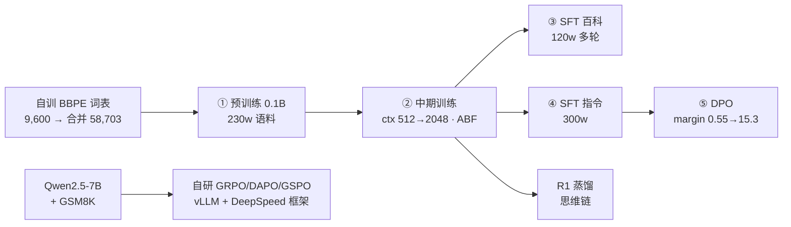

# learn-LLM · 从手写算子到自研 RLHF 框架的大模型全栈实践

从 PyTorch 手写算子出发，自训分词器、从零预训练中文 0.1B 模型，走完 SFT → 蒸馏 → DPO 全链路对齐，最终自研 **vLLM rollout 与 DeepSpeed 训练解耦的 GRPO / DAPO / GSPO 分布式强化学习框架**。

学习原则：**不调包，逐层手写验证**。LoRA、多头注意力、MinHash 去重、PPO、GRPO 目标函数等核心组件均有「自己实现 + 单元验证」版本。

## 成果一：一条从零训练到偏好对齐的完整模型链

所有阶段基于同一套自研体系：**Qwen3 架构 · 0.1B 参数 · 自训 BBPE 词表（合并后 58,703）**。每个阶段的产出模型就是下一阶段的输入，没有任何一环跳过：

| 阶段 | 产出模型 | 训练数据 | 训练 loss | 验证 loss | 备注 |
|---|---|---|---|---|---|
| ① 预训练 | `pretrain-qwen-0.1B` | 230 万条中文语料（wiki / firefly / belle） | 11.01 → 2.63 | 5.68 → 2.66 | PPL ≈ 14.2，ctx 512 |
| ② 中期训练 | `midtrain-qwen-0.1B` | 80 万条（Infinity-Instruct / cosmopedia） | — | 2.76 → 2.62 | ctx 512→2048，rope θ 10⁴→10⁵（ABF）；6,240 步 / 2.2 h |
| ③ SFT · 百科问答 | `sft-baike-qwen-0.1B` | 120 万条多轮对话 | 2.99 → 1.11 | 1.27 → 1.14 | 多轮 user/assistant loss 掩码 |
| ④ SFT · 指令强化 | `sft-plus-qwen-0.1B` | 300 万条中文指令 | 2.60 → 1.04 | 1.22 → 1.07 | 与③并行的另一分支 |
| ⑤ DPO 对齐 | `dpo-qwen-0.1B` | 自建偏好对 | 0.496 → 0.0003 | reward margin 0.55 → 15.33 | 809 步 / 19 min |

并行分支：**R1 思维链蒸馏**（loss 2.38 → 1.55，验证 1.76 → 1.65，5 epoch）。

## 成果二：自研分布式强化学习训练框架

`Step7RL/7.post_train-stage/rlhf_grpo/` 下约 800 行完全自研代码，训练与推理解耦：

- **rollout 进程**：vLLM 独立进程负责采样（n=8 条/prompt），权重经 `mp.Queue` 每 16 步热更新
- **训练进程**：DeepSpeed 引擎做 GRPO / DAPO / GSPO 三种算法更新，可配置切换
- **参考模型服务**：bottle + tornado 自建 HTTP 服务计算 ref logp，二进制协议通信，LIFO 队列
- **算法细节**：K3 KL 估计、DAPO 的 Clip-Higher + 去 KL + token-level loss、GSPO 的序列级重要性采样、组内优势归一化、无区分度组自动丢弃
- **评测闭环**：每 20 步在 100 条测试集上评估格式准确率 + 答案准确率；rollout 全量落盘用于 badcase 分析（`saved/reasoning_log.txt`）

## 目录导航

| 目录 | 主题 | 关键产出 |
|---|---|---|
| [`foundation/`](./foundation) | PyTorch 底层复现 | 手写 nn.Module / Conv2d / MaxPool / ReLU |
| [`Step0 pytorch/`](./Step0%20pytorch) | 训练基础与序列建模 | 手写梯度下降训练循环；中英 RNN 翻译器（自训双语 BPE） |
| [`Step1 Transformer/`](./Step1%20Transformer) | Transformer 逐组件手写 | Attention / Encoder / Decoder / FFN / LayerNorm / Loss / 采样 / 位置编码 / 分词，附完整分类模型 |
| [`Step2 LLaMA/`](./Step2%20LLaMA) | LLaMA 结构拆解 | RMSNorm / SwiGLU / RoPE / GQA + KV Cache |
| [`Step3 DeepSeek/`](./Step3%20DeepSeek) | DeepSeek 架构复现 | MLA（Prefill / Decoding 两阶段 + 缓存）、DSA、MoE 负载均衡、MTP、YaRN |
| [`Step4pretrain/`](./Step4pretrain) | 预训练全流程 | 自训词表 · MinHash LSH 去重 · BERT 质量分类 · 0.1B 从零训练 · PPL + CEval 评测 |
| [`Step5Mid-Training/`](./Step5Mid-Training) | 中期训练 / SFT / PEFT | ctx 扩展继续预训练 · 双分支 SFT · R1 蒸馏 · 手写 LoRA/NF4 · 模型融合 · 32B 造 CoT |
| [`Step6 Reinforcement Learnig/`](./Step6%20Reinforcement%20Learnig) | RL 地基与对齐实战 | 手写 REINFORCE→AC→DQN→PPO · DPO/ORPO/APO · 自家 0.1B 模型 DPO · 电商文案业务项目 |
| [`Step7RL/`](./Step7RL) | 后训练 RL 框架 | 自研 GRPO/DAPO/GSPO · on-policy 蒸馏 · RLHF-PPO · 医疗 GRPO · r_zero |

## 数据资产

语料统一在 [`Step4pretrain/prepare_data/download.sh`](./Step4pretrain/prepare_data/download.sh) 管理，均为公开数据集：

| 用途 | 数据集 |
|---|---|
| 预训练 | wikipedia-cn-20230720-filtered、wikipedia-zh-cn、firefly-train-1.1M、BelleGroup train_2M_CN |
| 中期训练 | Infinity-Instruct、chinese-cosmopedia |
| SFT | I_Wonder_Why-Chinese、Chinese-Instruct-Lite、instruct-data-basics-smollm-H4 |
| 思维链蒸馏 | Chinese-DeepSeek-R1-Distill-data-110k、deepseek_r1_zh、Alpaca-Distill-R1-ZH |
| RL | openai/gsm8k |

**体积说明**：仓库已上传 41,683 个文件（约 1.09 GB）。所有 ≥10MB 的数据集与模型权重（196 个文件，约 108.7 GB）按体积排除、仅保留在本地，逐条清单见 `.gitignore` 末尾「按体积排除的文件」段落。clone 后需按上表重新下载数据。

## 环境与复现

<!-- TODO: 补充 requirements.txt 后在此填入安装命令 -->

- 训练框架：PyTorch + HuggingFace Transformers / TRL / DeepSpeed（ZeRO-2）、vLLM（rollout）、Data-Juicer（数据流水线）、Unsloth（LoRA RL）、lm-evaluation-harness（评测）
- 硬件：SFT / 中期训练在云端 4 卡环境完成（DeepSpeed 启动脚本见各目录 `*.sh`）；GRPO 框架需至少 2 卡（1 卡训练 + 1 卡 vLLM 采样）
- 各阶段的启动入口：

| 阶段 | 入口 |
|---|---|
| 分词器训练 | `Step4pretrain/custom_tokenizer/train_tokenizer.py` |
| 预训练 | `Step4pretrain/train_llm/pre_train.py` |
| 中期训练 | `Step5Mid-Training/mid_training/run_mid.sh` |
| SFT | `Step5Mid-Training/full_sft/run_sft.sh` |
| DPO | `Step6 Reinforcement Learnig/dpo_train/dpo_train.py` |
| GRPO | `Step7RL/7.post_train-stage/rlhf_grpo/train.py`（先起 `ref_server.py`） |

## 评测结果

<!-- TODO: 在此填入 CEval / CMMLU 等 benchmark 分数表 -->
<!-- TODO: 在此填入 GRPO 训练前后 format accuracy / answer accuracy 对比 -->

PPL 与 loss 曲线的完整数据保留在各阶段 `log/*_running_states.json`，可视化见各目录 `plot.ipynb`。
