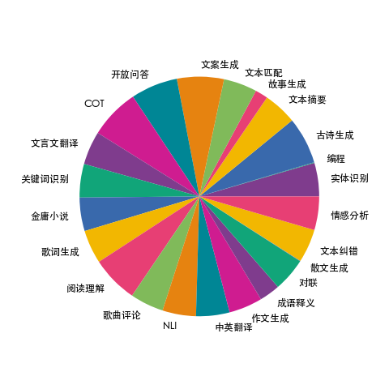
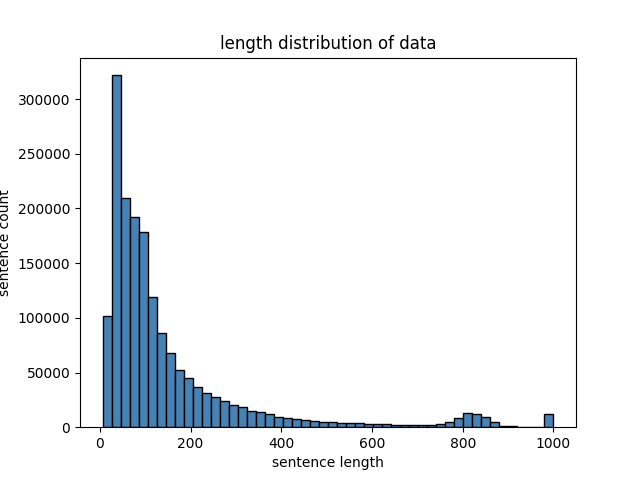

本数据应用于项目：[Firefly（流萤）: 中文对话式大语言模型](https://github.com/yangjianxin1/Firefly) ，训练后得到的模型[firefly-1b4](https://huggingface.co/YeungNLP/firefly-1b4)

如果您觉得此数据集对您有帮助，请like此数据集并在Github项目中star我们。

我们收集了23个常见的中文数据集，对于每个任务，由人工书写若干种指令模板，保证数据的高质量与丰富度，数据量为115万 。数据分布如下图所示：


每条数据的格式如下，包含任务类型、输入、目标输出：
```json
{
  "kind": "ClassicalChinese", 
  "input": "将下面句子翻译成现代文：\n石中央又生一树，高百余尺，条干偃阴为五色，翠叶如盘，花径尺余，色深碧，蕊深红，异香成烟，著物霏霏。",
  "target": "大石的中央长着一棵树，一百多尺高，枝干是彩色的，树叶有盘子那样大，花的直径有一尺宽，花瓣深蓝色，花中飘出奇异的香气笼罩着周围，如烟似雾。"
}
```

训练数据集的token长度分布如下图所示，绝大部分数据的长度都小于600：
